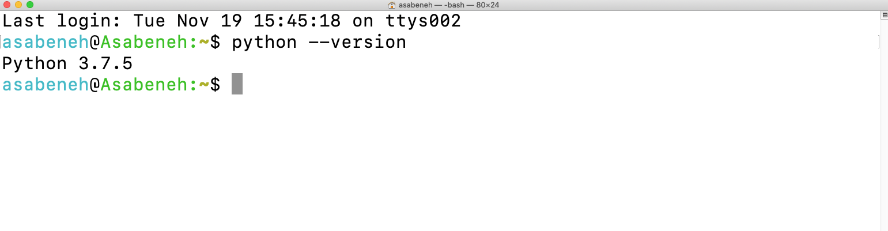
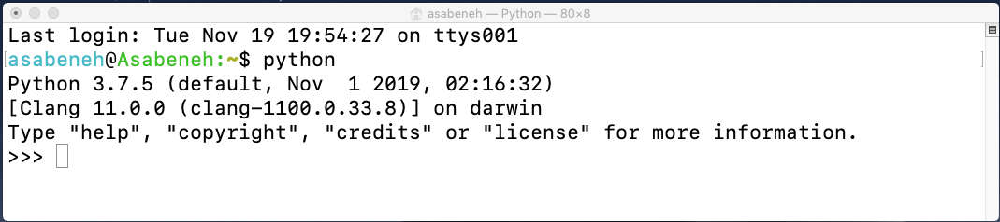
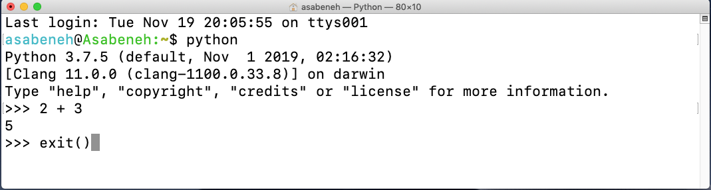
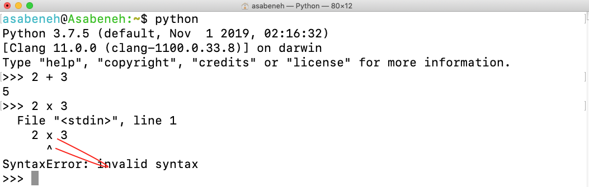
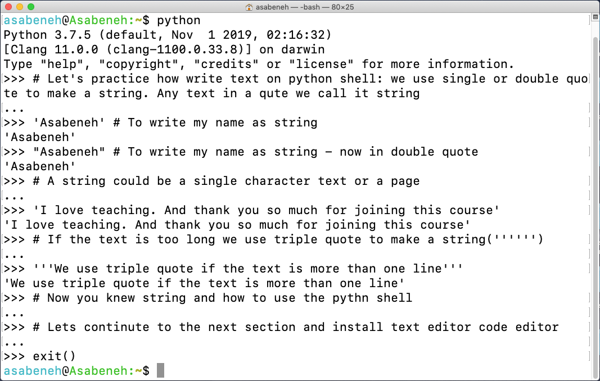
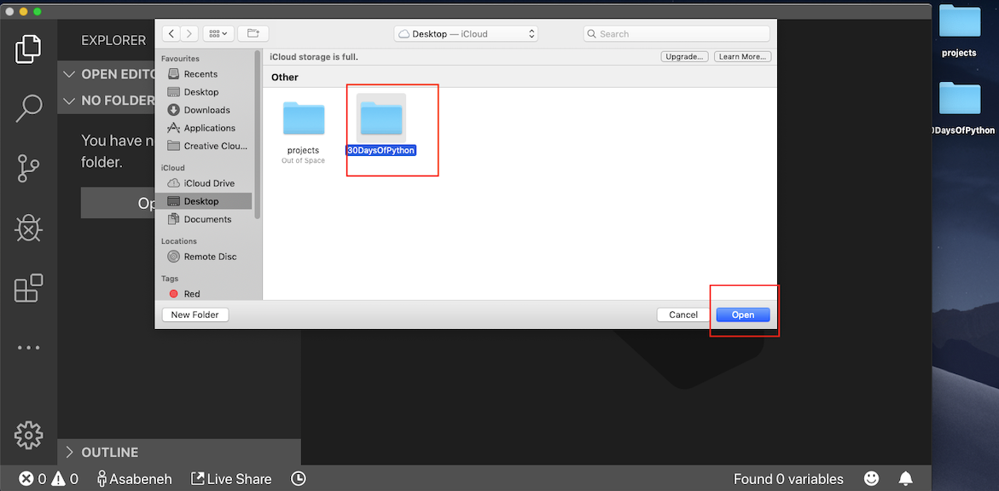
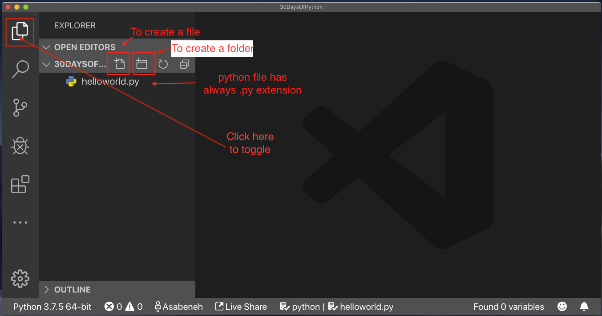
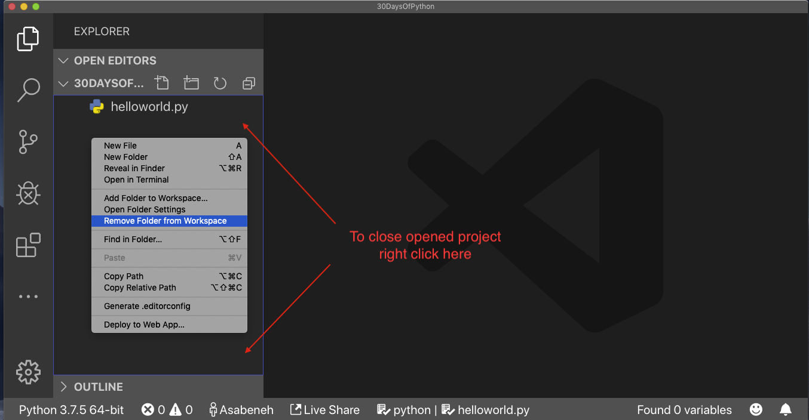
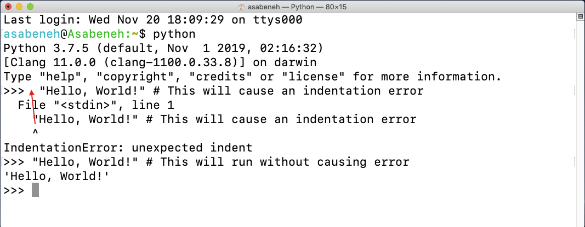

# 🐍 30 Days Of Python

|# Day | Topics                                                    |
|------|:---------------------------------------------------------:|
| 01  |  [简介](./readme.md)|
| 02  |  [变量与内置函数](./02_Day_Variables_builtin_functions/02_variables_builtin_functions_变量与内置函数.md)|
| 03  |  [运算符](./03_Day_Operators/03_operators_运算符.md)|
| 04  |  [字符串](./04_Day_Strings/04_strings_字符串.md)|
| 05  |  [列表](./05_Day_Lists/05_lists_列表.md)|
| 06  |  [元组](./06_Day_Tuples/06_tuples_元组.md)|
| 07  |  [集合](./07_Day_Sets/07_sets_集合.md)|
| 08  |  [字典](./08_Day_Dictionaries/08_dictionaries_字典.md)|
| 09  |  [条件语句](./09_Day_Conditionals/09_conditionals_条件语句.md)|
| 10  |  [循环](./10_Day_Loops/10_loops_循环.md)|
| 11  |  [函数](./11_Day_Functions/11_functions_函数.md)|
| 12  |  [模块](./12_Day_Modules/12_modules_模块.md)|
| 13  |  [列表推导式](./13_Day_List_comprehension/13_list_comprehension_列表推导式.md)|
| 14  |  [高阶函数](./14_Day_Higher_order_functions/14_higher_order_functions_高阶函数.md)|
| 15  |  [Python 类型错误](./15_Day_Python_type_errors/15_python_type_errors_Python类型错误.md)|
| 16 |  [Python 日期时间](./16_Day_Python_date_time/16_python_datetime_Python日期时间.md) |
| 17 |  [异常处理、打包解包、展开、枚举与压缩](./17_Day_Exception_handling/17_exception_handling_异常处理_打包解包_展开_枚举_压缩.md)|
| 18 |  [正则表达式](./18_Day_Regular_expressions/18_regular_expressions_正则表达式.md)|
| 19 |  [文件处理](./19_Day_File_handling/19_file_handling_文件处理.md)|
| 20 |  [Python 包管理器](./20_Day_Python_package_manager/20_python_package_manager_Python包管理器.md)|
| 21 |  [类与对象](./21_Day_Classes_and_objects/21_classes_and_objects_类与对象.md)|
| 22 |  [网络爬虫](./22_Day_Web_scraping/22_web_scraping_网络爬虫.md)|
| 23 |  [虚拟环境](./23_Day_Virtual_environment/23_virtual_environment_虚拟环境.md)|
| 24 |  [统计学](./24_Day_Statistics/24_statistics_统计学.md)|
| 25 |  [Pandas](./25_Day_Pandas/25_pandas_Pandas.md)|
| 26 |  [Python Web 开发](./26_Day_Python_web/26_python_web_Python_Web开发.md)|
| 27 |  [Python 与 MongoDB](./27_Day_Python_with_mongodb/27_python_with_mongodb_Python与MongoDB.md)|
| 28 |  [API](./28_Day_API/28_API_API.md)|
| 29 |  [构建 API](./29_Day_Building_API/29_building_API_构建API.md)|
| 30 |  [总结](./30_Day_Conclusions/30_conclusions_总结.md)|


<small>🧡🧡🧡 HAPPY CODING 🧡🧡🧡</small>

---
<div>
<h2>💖 赞助商（Sponsors）</h2>

<p>感谢我们出色的赞助商对本人开源贡献以及 <strong>30 Days of Challenge</strong> 系列的大力支持！</p>

<h3>当前赞助商</h3>
<hr />
<div align="center">
  <a href="https://ref.wisprflow.ai/MPMzRGE" target="_blank" rel="noopener noreferrer">
    <picture>
      <!-- 深色模式（Dark mode） -->
      <source media="(prefers-color-scheme: dark)" srcset="https://raw.githubusercontent.com/Asabeneh/asabeneh/master/images/Wispr_Flow-Logo-white.png" />
      <!-- 浅色模式（Light mode，回退） -->
      
    </picture>
  </a>

  <h1>
    <a href="https://ref.wisprflow.ai/MPMzRGE" target="_blank" rel="noopener noreferrer">
      用语音编写代码，保持心流（Flow）。
    </a>
  </h1>

  <h2>
    <a href="https://ref.wisprflow.ai/MPMzRGE" target="_blank" rel="noopener noreferrer">
      Flow 专为沉浸于工具中的开发者打造。通过语音提供更多上下文，获得更出色的结果。
    </a>
  </h2>
</div>
<hr />
<div align="center">
  <a href="https://client.petrosky.io/aff.php?aff=402" target="_blank" rel="noopener noreferrer">
    <picture>
      <!-- 深色模式（Dark mode） -->
      <source media="(prefers-color-scheme: dark)" srcset="https://raw.githubusercontent.com/Asabeneh/asabeneh/master/images/petrosky-logo-white.png" />
      <!-- 浅色模式（Light mode，回退） -->
      
    </picture>
  </a>

  <h1>
    <a href="https://client.petrosky.io/aff.php?aff=402" target="_blank" rel="noopener noreferrer">
      为你的整个旅程提供托管服务！
    </a>
  </h1>

  <h2>
    <a href="https://client.petrosky.io/aff.php?aff=402" target="_blank" rel="noopener noreferrer">
      满足你所有需求的平价 VPS 托管服务
    </a>
  </h2>
</div>

---

### 🙌 成为赞助商

你可以通过 **[GitHub Sponsors](https://github.com/sponsors/asabeneh)** 或 [PayPal](https://www.paypal.me/asabeneh) 成为赞助商来支持本项目。

每一笔贡献，无论大小，都意义重大。感谢你的支持！🌟

---

<div align="center">
  <h1> 30 Days Of Python：第 1 天 - 简介</h1>
  <a class="header-badge" target="_blank" href="https://www.linkedin.com/in/asabeneh/">
  
  </a>
  <a class="header-badge" target="_blank" href="https://twitter.com/Asabeneh">
  
  </a>

  <sub>作者（Author）：
  <a href="https://www.linkedin.com/in/asabeneh/" target="_blank">Asabeneh Yetayeh</a><br>
  <small> 第二版（Second Edition）：2021 年 7 月</small>
  </sub>
</div>

🇧🇷 [Portuguese](./Portuguese/README.md)
🇨🇳 [中文](./Chinese/README.md)
🇫🇷[French](./French/README_fr.md)
[第 2 天 >>](./02_Day_Variables_builtin_functions/02_variables_builtin_functions_变量与内置函数.md)


- [🐍 30 Days Of Python](#-30-days-of-python)
    - [🙌 成为赞助商](#-成为赞助商)
- [📘 第 1 天](#-第-1-天)
  - [欢迎（Welcome）](#欢迎welcome)
  - [简介（Introduction）](#简介introduction)
  - [为什么选择 Python？](#为什么选择-python)
  - [环境搭建](#环境搭建)
    - [安装 Python](#安装-python)
    - [Python Shell](#python-shell)
    - [安装 Visual Studio Code](#安装-visual-studio-code)
      - [如何使用 Visual Studio Code](#如何使用-visual-studio-code)
  - [Python 基础](#python-基础)
    - [Python 语法](#python-语法)
    - [Python 缩进](#python-缩进)
    - [注释（Comments）](#注释comments)
    - [数据类型（Data types）](#数据类型data-types)
      - [数字（Number）](#数字number)
      - [字符串（String）](#字符串string)
      - [布尔值（Booleans）](#布尔值booleans)
      - [列表（List）](#列表list)
      - [字典（Dictionary）](#字典dictionary)
      - [元组（Tuple）](#元组tuple)
      - [集合（Set）](#集合set)
    - [检查数据类型](#检查数据类型)
    - [Python 文件](#python-文件)
  - [💻 练习 - 第 1 天](#-练习---第-1-天)
    - [练习：第 1 级](#练习第-1-级)
    - [练习：第 2 级](#练习第-2-级)
    - [练习：第 3 级](#练习第-3-级)

# 📘 第 1 天

## 欢迎（Welcome）

**恭喜**你决定参加 _30 days of Python_ 编程挑战。在本挑战中，你将学习成为 Python 程序员所需的一切知识以及编程的整体概念。在挑战结束时，你将获得 _30DaysOfPython_ 编程挑战证书。

如果你想积极参与挑战，可以加入 [30DaysOfPython challenge](https://t.me/ThirtyDaysOfPython) Telegram 群组。

## 简介（Introduction）

Python 是一种用于通用编程的高级编程语言。它是一种开源、解释型、面向对象的编程语言。Python 由荷兰程序员 Guido van Rossum 创建。Python 编程语言的名字来源于英国喜剧小品节目 *Monty Python's Flying Circus*。首个版本于 1991 年 2 月 20 日发布。本次 30 days of Python 挑战将帮助你逐步学习最新版本的 Python——Python 3。主题被分解为 30 天，每天包含多个主题，配有易于理解的讲解、真实世界的示例以及大量动手练习和项目。

本挑战专为希望学习 Python 编程语言的初学者和专业人士设计。完成该挑战可能需要 30 到 100 天。积极参与 Telegram 群组的人完成挑战的概率很高。

本挑战易于阅读，以对话式的英语撰写，引人入胜、激励人心，同时也非常具有挑战性。你需要投入大量时间来完成这个挑战。如果你是视觉型学习者，可以在 <a href="https://www.youtube.com/channel/UC7PNRuno1rzYPb1xLa4yktw">Washera</a> YouTube 频道观看视频课程。你可以从 [Python for Absolute Beginners video](https://youtu.be/OCCWZheOesI) 开始。订阅该频道，在 YouTube 视频下评论和提问并积极主动，作者最终会注意到你。

作者希望听到你对挑战的看法，请分享你对 30DaysOfPython 挑战的想法。你可以通过此[链接](https://www.asabeneh.com/testimonials)留下你的感言。

## 为什么选择 Python？

它是一种非常接近人类语言的编程语言，因此易于学习和使用。
Python 被各个行业和公司（包括 Google）使用。它被用于开发 Web 应用程序、桌面应用程序、系统管理以及机器学习库。Python 在数据科学和机器学习社区中备受推崇。我希望这足以说服你开始学习 Python。Python 正在吞噬世界，你要在它吞噬你之前先发制人。

## 环境搭建

### 安装 Python

要运行 Python 脚本，你需要安装 Python。让我们[下载](https://www.python.org/) Python。
如果你是 Windows 用户，点击红色圆圈标记的按钮。

[](https://www.python.org/)

如果你是 macOS 用户，点击红色圆圈标记的按钮。

[](https://www.python.org/)

要检查 Python 是否已安装，在设备终端上输入以下命令。

```shell
python3 --version
```



如你在终端中所见，我目前使用的是 _Python 3.7.5_ 版本。你的 Python 版本可能与我不同，但应该是 3.6 或更高版本。如果你成功看到了 Python 版本，做得很好。Python 已经安装在你的机器上了。继续下一节。

### Python Shell

Python 是一种解释型脚本语言，因此不需要编译。这意味着它逐行执行代码。Python 自带一个 _Python Shell（Python 交互式解释器）_。它用于执行单条 Python 命令并获取结果。

Python Shell 等待用户输入代码。当你输入代码时，它会解释代码并在下一行显示结果。
打开终端或命令提示符（cmd）并输入：

```shell
python
```



Python 交互式解释器已打开，正在等待你编写 Python 代码（Python 脚本）。你将在此符号 >>> 旁边编写 Python 脚本，然后按 Enter 键。
让我们在 Python 交互式解释器上编写我们的第一个脚本。


做得好，你在 Python 交互式解释器上编写了你的第一个 Python 脚本。我们如何关闭 Python 交互式解释器？
要关闭解释器，在此符号 >>> 旁边输入 **exit()** 命令并按 Enter 键。



现在，你知道如何打开 Python 交互式解释器以及如何退出它了。

如果你编写的脚本是 Python 能理解的，Python 会返回结果；否则它会返回错误。让我们故意犯一个错误，看看 Python 会返回什么。



如你在返回的错误中所见，Python 非常聪明，它知道我们犯的错误是 _Syntax Error: invalid syntax_。在 Python 中使用 x 作为乘法符号是一个语法错误，因为 (x) 在 Python 中不是有效的语法。我们使用星号（*）来进行乘法运算。返回的错误清楚地显示了需要修复的内容。

识别和移除程序中错误的过程称为 _调试（debugging）_。让我们通过将 * 放在 **x** 的位置来修复它。


我们的 bug 已修复，代码运行了，我们得到了预期的结果。作为程序员，你每天都会遇到这类错误。了解如何调试是很好的。要擅长调试，你应该理解你面临的错误类型。你可能遇到的一些 Python 错误包括 _SyntaxError_、_IndexError_、_NameError_、_ModuleNotFoundError_、_KeyError_、_ImportError_、_AttributeError_、_TypeError_、_ValueError_、_ZeroDivisionError_ 等。我们将在后续章节中了解更多关于不同 Python **_错误类型_** 的内容。

让我们进一步练习如何使用 Python 交互式解释器。转到你的终端或命令提示符并输入 **python**。


Python 交互式解释器已打开。让我们做一些基本的数学运算（加法、减法、乘法、除法、取模、幂运算）。

让我们在编写任何 Python 代码之前先做一些数学计算：

- 2 + 3 = 5
- 3 - 2 = 1
- 3 \* 2 = 6
- 3 / 2 = 1.5
- 3 \*\* 2 = 3 x 3 = 9

在 Python 中，我们还有以下额外的运算：

- 3 % 2 = 1 => 表示求余数
- 3 // 2 = 1 => 表示去除余数

让我们将上面的数学表达式转换为 Python 代码。Python 解释器已打开，让我们在解释器最开头写一条注释。

_注释（comment）_ 是代码中不被 Python 执行的部分。因此我们可以在代码中留下一些文本来使代码更具可读性。Python 不运行注释部分。Python 中的注释以井号（#）开头。
以下是在 Python 中写注释的方法：

```shell
 # 注释以井号开头
 # 这是一个 Python 注释，因为它以 (#) 符号开头
```


在继续下一节之前，让我们在 Python 交互式解释器上多练习。通过在解释器上输入 _exit()_ 关闭已打开的解释器，然后重新打开它，让我们练习如何在 Python 解释器上写文本。



### 安装 Visual Studio Code

Python 交互式解释器适合尝试和测试小段脚本代码，但它不适合大型项目。在实际工作环境中，开发者使用不同的代码编辑器来编写代码。在本次 30 days of Python 编程挑战中，我们将使用 Visual Studio Code。Visual Studio Code 是一个非常流行的开源文本编辑器。我是 vscode 的粉丝，我建议[下载](https://code.visualstudio.com/) Visual Studio Code，但如果你更喜欢其他编辑器，请随意使用你已有的工具。

[](https://code.visualstudio.com/)

如果你已安装 Visual Studio Code，让我们看看如何使用它。
如果你更喜欢视频，可以观看这个 Visual Studio Code for Python [视频教程](https://www.youtube.com/watch?v=bn7Cx4z-vSo)

#### 如何使用 Visual Studio Code

通过双击 Visual Studio Code 图标打开它。当你打开它时，你会看到这种界面。尝试与标记的图标进行交互。


在你的桌面上创建一个名为 30DaysOfPython 的文件夹。然后使用 Visual Studio Code 打开它。




打开后，你会看到在 30DaysOfPython 项目目录内创建文件和文件夹的快捷方式。如下所示，我已经创建了第一个文件 `helloworld.py`。你可以做同样的事情。



经过一天的编码后，你想关闭你的代码编辑器，对吧？以下是如何关闭已打开的项目。



恭喜，你已完成开发环境的搭建。让我们开始编码。

## Python 基础

### Python 语法

Python 脚本可以在 Python 交互式解释器中或在代码编辑器中编写。Python 文件的扩展名是 .py。

### Python 缩进

缩进（indentation）是文本中的空白。在许多语言中，缩进用于提高代码可读性；然而，Python 使用缩进创建代码块。在其他编程语言中，花括号用于创建代码块而不是缩进。编写 Python 代码时常见的 bug 之一是缩进不正确。



### 注释（Comments）

注释在提高代码可读性以及允许开发者在代码中留下说明方面起着至关重要的作用。在 Python 中，任何以井号（#）开头的文本都被视为注释，在代码运行时不会被执行。

**示例：单行注释**

```shell
    # 这是第一条注释
    # 这是第二条注释
    # Python 正在吞噬世界
```

**示例：多行注释**

如果三引号未赋值给变量，则可用于多行注释

```shell
"""这是多行注释
多行注释占用多行。
python 正在吞噬世界
"""
```

### 数据类型（Data types）

在 Python 中有几种数据类型。让我们从最常见的开始。不同的数据类型将在其他章节中详细介绍。目前，让我们先浏览不同的数据类型并熟悉它们。你现在不必有清晰的理解。

#### 数字（Number）

- 整数（Integer）：整数（负数、零和正数）
    示例：
    ... -3, -2, -1, 0, 1, 2, 3 ...
- 浮点数（Float）：小数
    示例：
    ... -3.5, -2.25, -1.0, 0.0, 1.1, 2.2, 3.5 ...
- 复数（Complex）
    示例：
    1 + j, 2 + 4j

#### 字符串（String）

在单引号或双引号下的一个或多个字符的集合。如果一个字符串超过一个句子，我们使用三引号。

**示例：**

```py
'Asabeneh'
'Finland'
'Python'
'I love teaching'
'I hope you are enjoying the first day of 30DaysOfPython Challenge'
```

#### 布尔值（Booleans）

布尔数据类型是 True 或 False 值。T 和 F 应始终大写。

**示例：**

```python
    True  # 灯亮着吗？如果亮着，则值为 True
    False # 灯亮着吗？如果关着，则值为 False
```

#### 列表（List）

Python 列表（list）是一种有序集合，允许存储不同数据类型的元素。列表类似于 JavaScript 中的数组。

**示例：**

```py
[0, 1, 2, 3, 4, 5]  # 都是相同的数据类型 - 数字列表
['Banana', 'Orange', 'Mango', 'Avocado'] # 都是相同的数据类型 - 字符串列表（水果）
['Finland','Estonia', 'Sweden','Norway'] # 都是相同的数据类型 - 字符串列表（国家）
['Banana', 10, False, 9.81] # 列表中的不同数据类型 - 字符串、整数、布尔值和浮点数
```

#### 字典（Dictionary）

Python 字典（dictionary）对象是一种以键值对（key-value pair）格式存储数据的无序集合。

**示例：**

```py
{
'first_name':'Asabeneh',
'last_name':'Yetayeh',
'country':'Finland',
'age':250,
'is_married':True,
'skills':['JS', 'React', 'Node', 'Python']
}
```

#### 元组（Tuple）

元组（tuple）是一种类似列表的有序集合，包含不同的数据类型，但元组一旦创建就不可修改。它们是不可变的（immutable）。

**示例：**

```py
('Asabeneh', 'Pawel', 'Brook', 'Abraham', 'Lidiya') # 名字
```

```py
('Earth', 'Jupiter', 'Neptune', 'Mars', 'Venus', 'Saturn', 'Uranus', 'Mercury') # 行星
```

#### 集合（Set）

集合（set）是一种类似列表和元组的数据类型集合。与列表和元组不同，集合不是元素的有序集合。像数学中一样，Python 中的集合只存储唯一的元素。

在后续章节中，我们将详细介绍每种 Python 数据类型。

**示例：**

```py
{2, 4, 3, 5}
{3.14, 9.81, 2.7} # 在集合中顺序不重要
```

### 检查数据类型

要检查某些数据/变量的数据类型，我们使用 **type** 函数。在以下终端中，你将看到不同的 Python 数据类型：


### Python 文件

首先打开你的项目文件夹 30DaysOfPython。如果你没有这个文件夹，创建一个名为 30DaysOfPython 的文件夹。在这个文件夹内，创建一个名为 helloworld.py 的文件。现在，让我们使用 Visual Studio Code 来做我们在 Python 交互式解释器上做过的事情。

Python 交互式解释器在不使用 **print** 的情况下就能打印，但在 Visual Studio Code 中，要看到我们的结果，我们应该使用内置函数 _print()_。_print()_ 内置函数接受一个或多个参数，如下所示 _print('arument1', 'argument2', 'argument3')_。请参见下面的示例。

**示例：**

文件名是 `helloworld.py`

```py
# 第 1 天 - 30DaysOfPython 挑战

print(2 + 3)             # 加法(+)
print(3 - 1)             # 减法(-)
print(2 * 3)             # 乘法(*)
print(3 / 2)             # 除法(/)
print(3 ** 2)            # 幂运算(**)
print(3 % 2)             # 取模(%)
print(3 // 2)            # 整除运算符(//)

# 检查数据类型
print(type(10))          # 整数（Int）
print(type(3.14))        # 浮点数（Float）
print(type(1 + 3j))      # 复数（Complex number）
print(type('Asabeneh'))  # 字符串（String）
print(type([1, 2, 3]))   # 列表（List）
print(type({'name':'Asabeneh'})) # 字典（Dictionary）
print(type({9.8, 3.14, 2.7}))    # 集合（Set）
print(type((9.8, 3.14, 2.7)))    # 元组（Tuple）
```

要运行 Python 文件，请查看下图。你可以通过点击 Visual Studio Code 上的绿色按钮或在终端输入 _python helloworld.py_ 来运行 Python 文件。


🌕 你太棒了。你刚刚完成了第 1 天的挑战，你正在通往伟大的道路上。现在为你的大脑和肌肉做一些练习。

## 💻 练习 - 第 1 天

### 练习：第 1 级

1. 检查你正在使用的 Python 版本
2. 打开 Python 交互式解释器并进行以下运算。操作数是 3 和 4。
   - 加法(+)
   - 减法(-)
   - 乘法(\*)
   - 取模(%)
   - 除法(/)
   - 幂运算(\*\*)
   - 整除运算符(//)
3. 在 Python 交互式解释器上写字符串。字符串如下：
   - 你的名字
   - 你的姓氏
   - 你的国家
   - I am enjoying 30 days of python
4. 检查以下数据的数据类型：
   - 10
   - 9.8
   - 3.14
   - 4 - 4j
   - ['Asabeneh', 'Python', 'Finland']
   - 你的名字
   - 你的姓氏
   - 你的国家

### 练习：第 2 级

1. 在 30DaysOfPython 文件夹内创建一个名为 day_1 的文件夹。在 day_1 文件夹内，创建一个 Python 文件 helloworld.py 并重复问题 1、2、3 和 4。记住当你在 Python 文件上工作时使用 _print()_。导航到你保存文件的目录，然后运行它。

### 练习：第 3 级

1. 为不同的 Python 数据类型编写示例，如 Number（整数、浮点数、复数）、字符串、布尔值、列表、元组、集合和字典。
2. 求 [欧几里得距离](https://en.wikipedia.org/wiki/Euclidean_distance#:~:text=In%20mathematics%2C%20the%20Euclidean%20distance,being%20called%20the%20Pythagorean%20distance.)，点 (2, 3) 和 (10, 8) 之间。

🎉 恭喜！🎉

[第 2 天 >>](./02_Day_Variables_builtin_functions/02_variables_builtin_functions_变量与内置函数.md)
